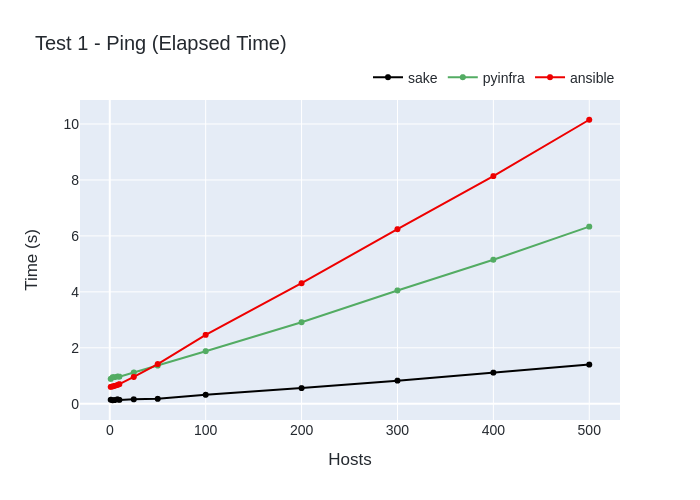
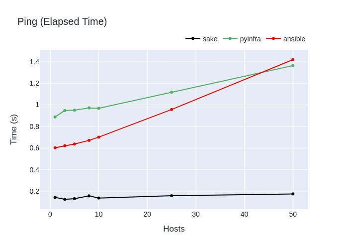
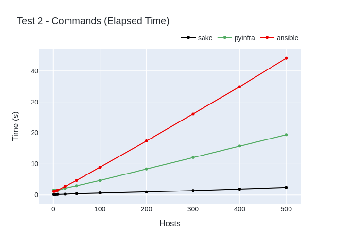
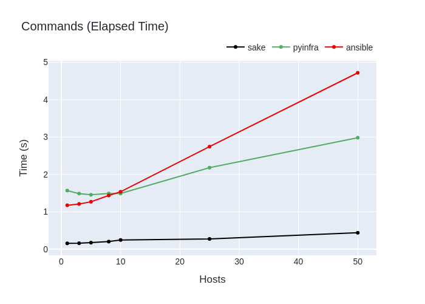
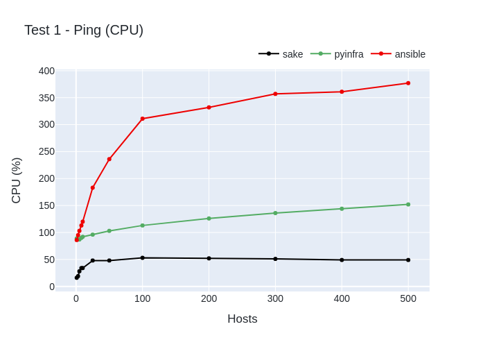
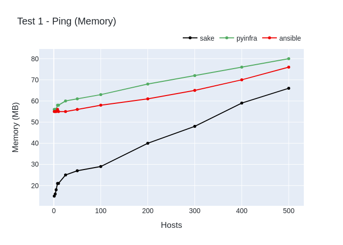
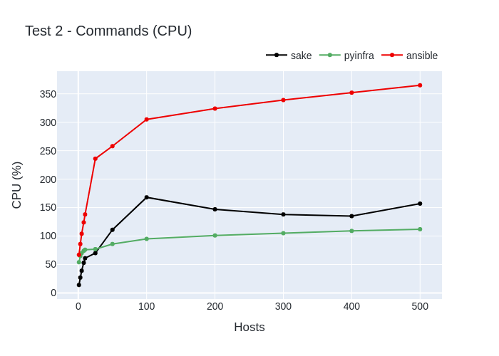
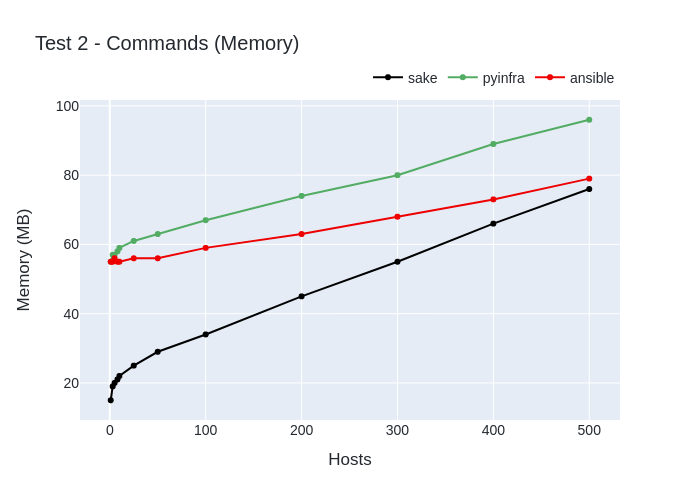

# Benchmarks

These are benchmark tests for [sake](https://github.com/alajmo/sake), [pyinfra](https://github.com/Fizzadar/pyinfra), and [Ansible](https://github.com/ansible/ansible).

I benchmark the following:

1. Running a raw shell command
2. Running commands using modules

## Summary

sake is between 6 and 8 faster than pyinfra and between 4 and 18 times faster than Ansible, depending on the number of hosts.

### Ping




### Modules




## Table of Contents

<!-- vim-markdown-toc GFM -->

- [Implementation](#implementation)
  - [Requirements](#requirements)
  - [Instructions](#instructions)
  - [Information](#information)
    - [Notes](#notes)
- [Results](#results)
  - [Test Case 1](#test-case-1)
  - [Test Case 2](#test-case-2)

<!-- vim-markdown-toc -->

## Implementation

Implementation details for each software can be found here:

- [sake](./sake)
- [pyinfra](./pyinfra)
- [ansible](./ansible)

I've made the following optimizations:

- all disable host checking
- all run in parallel with maximum number of forks
- pipelining is set to true for Ansible
- gather facts is disabled for Ansible

### Requirements

- [Bash](https://www.gnu.org/software/bash/)
- [Docker](https://www.docker.com/)
- [GNU datamash](https://www.gnu.org/software/datamash/)
- [GNU time](https://www.gnu.org/software/time/)
- [SSH](https://www.openssh.com/)
- [Miller](https://github.com/johnkerl/miller)
- [Ansible](https://www.ansible.com/)
- [pyinfra](https://pyinfra.com/)
- [sake](https://github.com/alajmo/sake)
- [Python](https://www.python.org/)

### Instructions

```bash
# Start 500 containers
./mock-ssh.sh

# Start 5 containers
# ./mock-ssh.sh 5

# Run benchmark tests, this will generate csv and images in the results directory
./benchmark.sh

# Run once per test and target only sake
# ./benchmark.sh -r 1 -s sake

# Generate graphs and open browser page with graphs
# python3 graph.py --show

# Update this README with the latest results
./update-readme.sh
```

Note, the `mock-ssh.sh` script starts 500 containers locally with a port range set between 10000 and 10500, so if you get a port collision, then try to find a port range with 500 available ports (to see open ports, run `netstat -ntlp`) and modify all relevant files.

### Information

I ran the tests with the following machine:

- **OS**: Debian GNU/Linux bookworm/sid x86_64
- **CPU**: Intel i9-9900K (16) @ 5.000GHz
- **Kernel**: 6.0.0-2-amd64
- **Memory**: 32GB
- **Shell**: zsh 5.9

The software I used:

- **sake**: 0.12.1
- **pyinfra**: 2.5.1
- **ansible**: core 2.13.4, python 3.10.7
- **ssh**: OpenSSH_9.0p1 Debian-1+b1, OpenSSL 3.0.5 5 Jul 2022
- **docker**: 20.10.17
- **datamash**: 1.7
- **gnu time**: 1.9-0.2
- **bash**: 5.1.16(1)
- **python**: 3.10.7

The benchmarks are generated by running each test 10 times and taking an average.

- **time**: The mean elapsed real (wall clock) time (seconds) used by the process
- **cpu**: Percentage of the CPU that this job got (`(user + sys time) / tot time`
- **mem**: Maximum memory (Megabyte) usage of the process during its lifetime

#### Notes

Before we look at the results, it's important to consider the following:

- Ansible and pyinfra use the Python runtime whereas sake uses Go
- The Go standard SSH library is faster than OpenSSH (which Ansible uses) and Paramiko (which pyinfra uses)
- Ansible and pyinfra provides idempotency for modules and thus have to execute a lot more code (both on the control plane and on the hosts)

To understand how each software works let's look at program execution:

1. sake
    1. Parse config files
    2. Establish connection to hosts in parallel
    3. Send out shell commands to be executed on host in parallel

2. pyinfra:
    1. Parse config files
    2. Connect to servers serially and gathers facts
    3. Do work locally using the facts and figure out which operations to perform on hosts
    4. Perform operations on hosts in parallel by sending out shell commands

3. Ansible: do work on a remote machine, get back info, send out shell command
    1. Parse config files
    2. Connect to servers in parallel
    3. Send over Ansible modules to hosts in parallel
    4. Execute (via Python) Ansible modules on hosts in parallel
    5. Remove previously copied Ansible resources

The big difference between Ansible and pyinfra is that pyinfras does its work on the local machine and sends out shell commands to configure servers, whereas Ansible does the work on the host machines using Python. Thus Ansible requires Python (for modules) to be installed on the remote hosts, whereas pyinfra only requires Python on the control plane.

Note, you could speed up Ansible by using Mitogen, but Mitogens Ansible support is limited to Ansible < 2.10 (latest stable Ansible is at 2.13.4).

## Results

Complete benchmark results can be found [here](./results).

### Test Case 1

This is the test case where we run 1 raw shell command.





Elapsed Time (seconds)

| name | sake | pyinfra | ansible |
| --- | --- | --- | --- |
| 1 | 0.143 | 0.888 | 0.602 |
| 3 | 0.125 | 0.948 | 0.621 |
| 5 | 0.131 | 0.951 | 0.637 |
| 8 | 0.157 | 0.972 | 0.671 |
| 10 | 0.137 | 0.968 | 0.701 |
| 25 | 0.158 | 1.117 | 0.957 |
| 50 | 0.175 | 1.364 | 1.419 |
| 100 | 0.320 | 1.879 | 2.463 |
| 200 | 0.559 | 2.914 | 4.308 |
| 300 | 0.826 | 4.050 | 6.240 |
| 400 | 1.112 | 5.148 | 8.137 |
| 500 | 1.400 | 6.332 | 10.152 |

CPU (%)

| name | sake | pyinfra | ansible |
| --- | --- | --- | --- |
| 1 | 16 | 89 | 86 |
| 3 | 19 | 87 | 95 |
| 5 | 28 | 87 | 103 |
| 8 | 34 | 90 | 113 |
| 10 | 34 | 92 | 120 |
| 25 | 48 | 96 | 183 |
| 50 | 48 | 103 | 236 |
| 100 | 53 | 113 | 311 |
| 200 | 52 | 126 | 332 |
| 300 | 51 | 136 | 357 |
| 400 | 49 | 144 | 361 |
| 500 | 49 | 152 | 377 |

Memory (MB)

| name | sake | pyinfra | ansible |
| --- | --- | --- | --- |
| 1 | 15 | 56 | 55 |
| 3 | 16 | 56 | 55 |
| 5 | 18 | 56 | 55 |
| 8 | 21 | 58 | 56 |
| 10 | 21 | 58 | 55 |
| 25 | 25 | 60 | 55 |
| 50 | 27 | 61 | 56 |
| 100 | 29 | 63 | 58 |
| 200 | 40 | 68 | 61 |
| 300 | 48 | 72 | 65 |
| 400 | 59 | 76 | 70 |
| 500 | 66 | 80 | 76 |

### Test Case 2

This is the test case where we run the following commands:

1. Install htop
2. Add a user
3. Add a file
4. Copy a file

Note the following:

- After the first command is ran, the subsequent commands won't do anything since the user and files already exists, so all the tasks are idempotent (even for sake)
- Ansible and pyinfra provide robust modules that handle a lot more edge-cases (and are prettier), whereas the ad-hoc written sake tasks only handles the basic cases (if not existing, add)





Elapsed Time (seconds)

| name | sake | pyinfra | ansible |
| --- | --- | --- | --- |
| 1 | 0.156 | 1.568 | 1.174 |
| 3 | 0.159 | 1.487 | 1.210 |
| 5 | 0.175 | 1.456 | 1.268 |
| 8 | 0.203 | 1.489 | 1.436 |
| 10 | 0.246 | 1.489 | 1.535 |
| 25 | 0.274 | 2.180 | 2.742 |
| 50 | 0.439 | 2.982 | 4.717 |
| 100 | 0.664 | 4.711 | 8.947 |
| 200 | 1.006 | 8.371 | 17.410 |
| 300 | 1.425 | 12.108 | 26.110 |
| 400 | 1.911 | 15.797 | 34.888 |
| 500 | 2.443 | 19.418 | 44.075 |

CPU (%)

| name | sake | pyinfra | ansible |
| --- | --- | --- | --- |
| 1 | 14 | 54 | 67 |
| 3 | 27 | 65 | 86 |
| 5 | 39 | 70 | 104 |
| 8 | 53 | 74 | 124 |
| 10 | 61 | 76 | 138 |
| 25 | 70 | 77 | 236 |
| 50 | 111 | 86 | 258 |
| 100 | 168 | 95 | 305 |
| 200 | 147 | 101 | 324 |
| 300 | 138 | 105 | 339 |
| 400 | 135 | 109 | 352 |
| 500 | 157 | 112 | 365 |

Memory (MB)

| name | sake | pyinfra | ansible |
| --- | --- | --- | --- |
| 1 | 15 | 55 | 55 |
| 3 | 19 | 57 | 55 |
| 5 | 20 | 57 | 56 |
| 8 | 21 | 58 | 55 |
| 10 | 22 | 59 | 55 |
| 25 | 25 | 61 | 56 |
| 50 | 29 | 63 | 56 |
| 100 | 34 | 67 | 59 |
| 200 | 45 | 74 | 63 |
| 300 | 55 | 80 | 68 |
| 400 | 66 | 89 | 73 |
| 500 | 76 | 96 | 79 |
